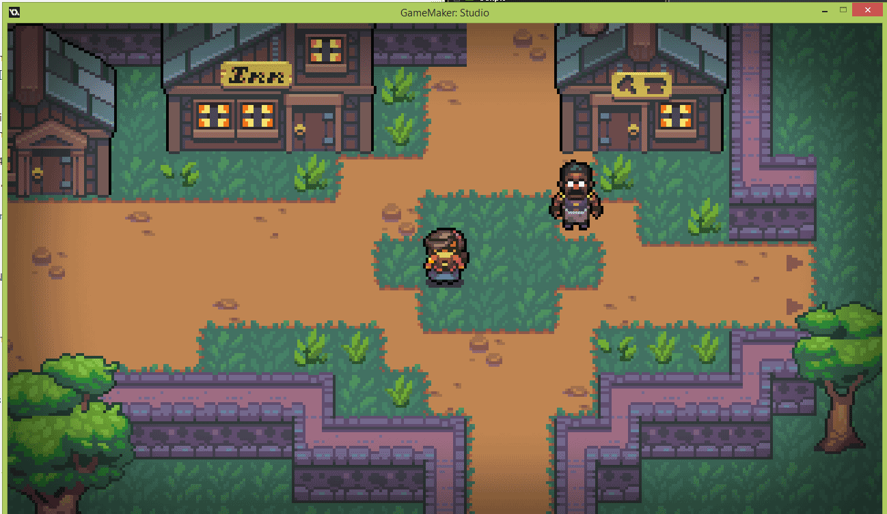
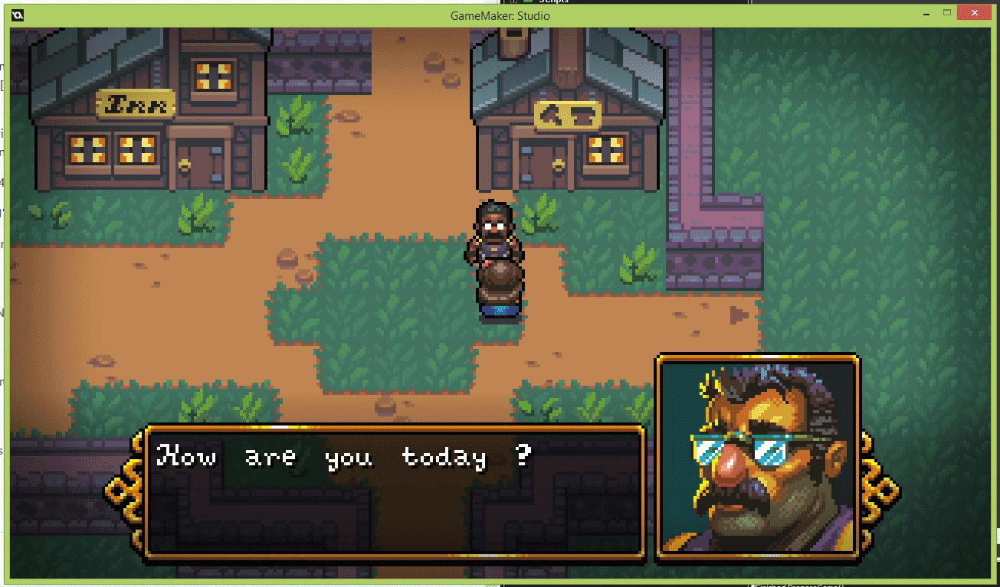
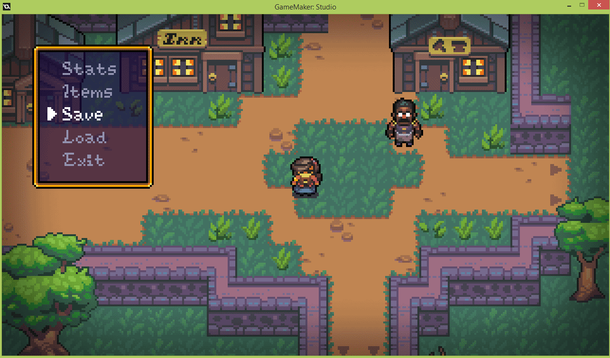
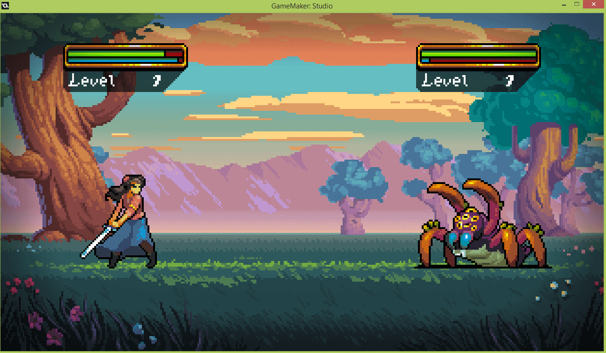

# RPG_GM
A turn by turn RPG made with Game Maker 1.4
Made with the assets and courses from Benjamin Anderson (https://twitter.com/uheartbeast)
[https://www.udemy.com/make-a-turn-based-rpg-in-gamemaker-studio-14/learn/v4/overview][1]

Credit:
Course programming, curriculum design, and lectures: Benjamin Kean Anderson
Game Pixel Art: Toby Dixon, Clement Swennes
Game Music Music: Dalin Anderson
Game Sound Design: Daniel Gunson

Project made with GameMaker 1.4.
The executable file is included in the final commit.

Here are a few examples of what I'm trying to achieve with this project :
> **Creating a 2D RPG turn by turn based game like "Final Fantasy VI"/"Golden Sun" :** 

> **Explore a town and speak to NPC** 

> **Create options and menus to make player using items like potions, etc...**

> **Fight against vicious monsters in engaging turn by turn combats**

